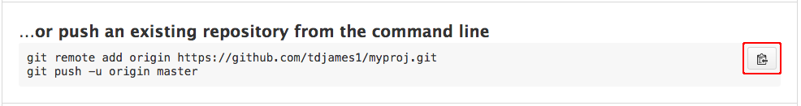
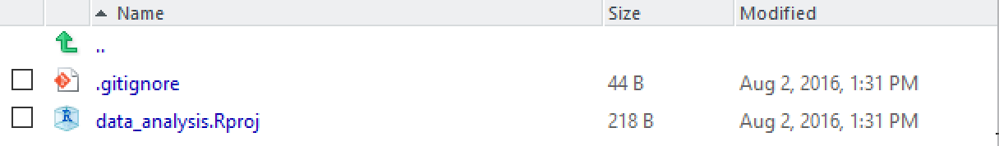
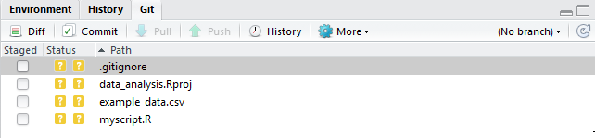
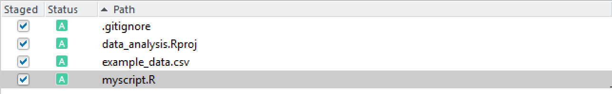
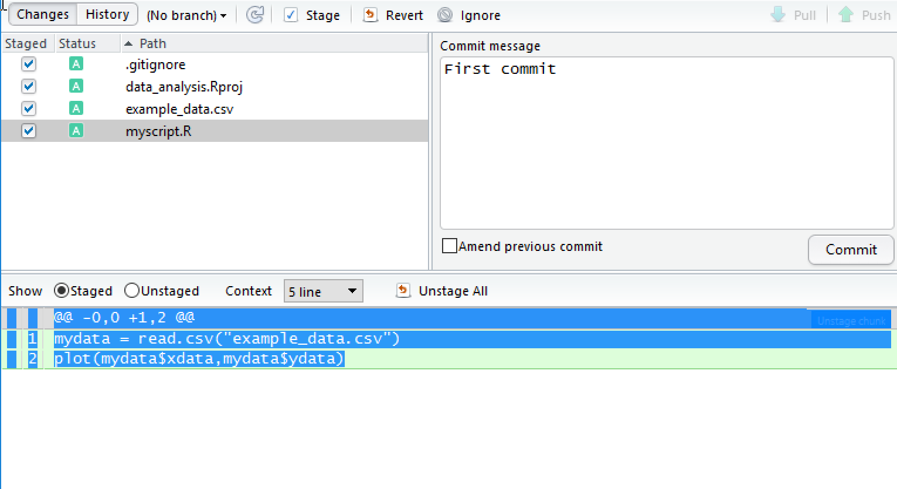

# Introduction to version control for research

This tutorial introduces a basic workflow for version control using
git and the popular online hosting service, GitHub, providing a
starting point for curating and distributing code for research.

The sections of this tutorial dealing with RStudio and GitHub were
adapted from Mike Croucher's
[ISBE_Symposium tutorial](https://github.com/mikecroucher/ISBE_Symposium).

## Preliminaries

Step through the instructions below to make sure that you have
everything you need to get started.

### Install git
You can download git here:
[https://git-scm.com/downloads](https://git-scm.com/downloads)

<!-- TODO: check this -->
If prompted, select the option to add the installation location to system path.

<!-- On Windows, you may need to select an option about "Adjusting your PATH environment". -->
<!-- The option "Run Git from the Windows Command Prompt" will help RStudio find git. -->

Open a terminal or command prompt and type `git version` to check that
the installation worked.

#### Configure git

After installing git, you need to tell it who you are. Open a terminal
window or command prompt and type the following:

```
git config --global user.email "you@youremail.com"
git config --global user.name "Your Name"
```

You can also configure git to use your preferred editor for commit
messages:

```
git config --global core.editor nano
```

### Sign up for an account on GitHub

GitHub is a popular online hosting service for git repositories. It
provides a useful interface for collaboration and code sharing.

Create a free account on GitHub:

[https://github.com/join](https://github.com/join)

***If you have an academic email account you should use it here.***
GitHub users can create an unlimited number of free, public
repositories but only a limited number of private
repositories. However, academic users can request access to an
unlimited number of free private repositories.

**Optional**

If you are an academic user, sign up for free private repositories here:

[https://education.github.com/discount_requests/new](https://education.github.com/discount_requests/new)

***This requires your account to be associated with an academic email
address.***

It may take a while to receive the verification email for
this step. Don't worry, we won't need this for the tutorial.


## Getting started with git

In this section of the tutorial the focus is on using git with the
command line.

### How does git work?

You tell git to manage the files in your project by setting up and
working within a **git repository**. This is simply a directory which
contains some hidden files used by git for bookkeeping.

Once your repository is set up, you need to tell git which files to
manage. Git will keep track of any modifications to the files that it
has been asked to manage. When you have made changes to your project,
you can record those changes as a **commit**. Each commit creates a
snapshot of the project directory, allowing you to make a record of
the state of your project through time.

## Setting up a git repository

To set up a local git repository, create a directory, move into it and
tell git to initialise the repository:

```
mkdir myproj
cd myproj
git init
```

This creates the hidden structure that git needs to start tracking
your files.

## Tell git which files you want to track

You need to tell git which files you want it to manage within the
working directory. To do this you `add` files:

```
echo "# My project" > README.md
git add README.md
```

The first line here creates a file called README.md containing the
specified string.

`git add` tells git to include the new file in the next commit
snapshot. This is called staging a file. `git add` is also used when
you want to tell git to stage files which are already under version
control.

You can use `git status` to produce a report about the current state
of the working directory. This will list files which contain changes
to be committed, those which contain changes that have not been
staged, and files which are not yet tracked.

## Get your project under version control

Creating your first commit will set up version control on the files
that you've asked git to track.

For the first commit you can use `git commit` with the `-m` option,
which allows you to specify a commit message directly:

```
git commit -m "My first commit"
```

## Making changes

Now that your project is under version control you can keep track of
the changes that you make.

Open the README.md file and add a few lines describing your
project. Also, change the heading from "My project" to something more
specific. Save and close the file.

Now, use `git status` to check the state of the working directory. It
should report that you've modified README.md. You can use `git diff`
to review your changes:


<!-- <pre> -->
<!-- diff --git a/README.md b/README.md -->
<!-- index 9848698..94fee06 100644 -->
<!-- --- a/README.md -->
<!-- +++ b/README.md -->
<!-- @@ -1 +1,6 @@ -->
<!-- -# My project -->
<!-- +# An introduction to version control for research -->
<!-- + -->
<!-- +This tutorial introduces a basic workflow for version control using -->
<!-- +git and the popular online hosting service, GitHub. The aim is to -->
<!-- +provide a starting point for researchers who want to curate and -->
<!-- +distribute their code. -->
<!-- </pre> -->

Lines prefaced with a `-` indicate lines that have been removed, while
lines with a `+` at the start are additions.

If you're happy with the changes that you've made, use `git add` to
stage your file.

## Commiting your changes

For most commits it's a good idea to write a commit message which
explains the modifications that you've made in some detail. This will
produce a record of the changes that you have made to your code over
time and may be useful when you want to review the history of your
project. Using

```
git commit
```

prompts git to open a text editor in which to compose your message.  A
good strategy is to start with a short, one-line summary of the
commit, followed by a longer description of your changes. For example:

    Update README file

    Update README file to include the proper title and a description
    of the project aims.

<!-- FIXME: link to configure subsection -->
See the section on [configuring git](#configure) to change the default
text editor.

## Reviewing version history

You can view the history of your project using `git log`. This lists
each commit together with its unique SHA1 identifier, date, author,
and commit message. The commit history can be extremely useful for
finding bugs or looking back to how your project looked a few months
ago. For example, to see a detailed report of the changes for a
particular commit you can use `git show -p` together with the first
part of the SHA1 identification string for that commit:

```
git show -p f9fae515
```

This will display the changes introduced in the specified commit in a
similar format to the output from `git diff`.

## Connecting to a remote repository

<!-- Our project is fully version controlled so we have access to a -->
<!-- detailed history of every change we've ever made to it. This is a -->
<!-- great first step but all of this only exists on our own computers at -->
<!-- the moment. -->

So far, everything that we've done has only affected our local
repository. Likely you'll want to connect your local repository to a
remote repository using a hosting service such as GitHub. Syncing your
local repository to a remote means that your code is backed up. Also,
the remote repository acts as a central store for your project,
allowing you to share your work or to access it from another computer.

### Creating a new repository on GitHub

First, you need to create a GitHub repository to use as a remote. Log
into GitHub and go to your profile page. On the **Repositories** tab,
click **New**.


At the **Create a new repository** screen, give your repository a name
and click **Create Repository**.


The next screen gives sets of git commands for use in various
circumstances. Find the section labelled **...or push an existing
repository from the command line** and copy the commands to the
clipboard.



These commands tell git to set the remote repository for your local
repository. The first line has the form:

```
git remote add origin https://github.com/ghuser/myproj.git
```

This indicates that you want to use the GitHub repository `myproj`
belonging to the user `ghuser` as the remote for your local
repository, using the `HTTPS` protocol.

<!-- TODO check link and set as footnote? -->

(There are two alternative methods for connecting to a remote, `HTTPS`
and `ssh`.  See the
[GitHub help pages](https://help.github.com/articles/which-remote-url-should-i-use/)
for more information.)

Having set the remote, you need to perform an initial `git push` to
push your local changes and set up your local branch (`master`) to
sync with the equivalent remote branch:

```
git push -u origin master
```

## Subsequent workflow

Once you've set up the remote repository, subsequent updates follow a
similar pattern:

* Add or make changes to files in your repository
* Stage the new/modified files:  `git add`
* Commit your changes: `git commit`
* Push local changes to the remote: `git push`

At any point you can use `git status` to find out the current state of
your repository. If you have made a local commit that has not yet been
pushed to the remote repository, `git status` will display a message
indicating that your local branch is ahead of `origin/master` (the
remote branch). Use

```
git push
```

to bring the remote branch up-to-date.

## Summary

We've introduced the following basic git workflow using git on the command line:

**Local operations**

- Staging files:    `git add <file>`
- Committing changes:    `git commit`
- Inspecting your workspace:    `git status`
- Reviewing history:    `git log`

**Syncing with a remote**

- Pushing local changes:   `git push`
<!-- - Merging remote changes `git pull` -->

### Going further

Git and GitHub are extremely powerful and flexible systems and there
is a lot more you can learn if you wish. Here are some starting points:

#### Documentation, cheatsheets and tutorials
- <code class="inline">git help &lt;command&gt;</code>
- [git -- the simple guide](http://rogerdudler.github.io/git-guide/)
- [http://git-scm.com/book](https://git-scm.com/book/en/v2)
- [git reference/cheatsheets](https://git-scm.com/docs)

<!-- Software Carpentry tutorial - http://swcarpentry.github.io/git-novice/ -->


## Setting up a git project in RStudio

RStudio provides an interface for version control using git. We'll
look at setting up and managing a version controlled project through
RStudio.

Create a new project in RStudio as follows:

**File** -> **New Project** -> **New Directory**


In the **Project Type** screen, click on **Empty Project**.


In the **Create New Project** screen, give your project a name and
ensure that **Create a git repository** is checked. Click on **Create
Project**.


RStudio will create a new folder containing an empty project and set
R's working directory to within it.



Two files are created in the otherwise empty project:

* **.gitignore** -- Specifies files that should be ignored by the
  version control system.
* **data_analysis.Rproj** -- Configuration information for the RStudio
  project.

There is no need to worry about the contents of either of these for
the purposes of this tutorial.

## Starting work on your project

Once your project is set up, you can start work on your analysis,
perhaps by creating an R script that reads in your data and carries
out some preliminary analysis. For the purposes of this tutorial,
create a simple script with a few lines of R.

## Getting your project under version control

After you've created the first file in your project, you need to get
it under version control. By default, the git version control pane is
in the top right hand corner of RStudio. Find it and click on the
**Git** tab. You'll see a list of the files in your project directory.



If you hover the mouse pointer over the yellow ? marks in RStudio,
you'll see a tooltip telling you that the files are **untracked**. This
means that git is not tracking versions of these files

Git will only keep track of modifications to files that it has been
asked to manage, so you need to tell git which files to track.

Tick the **Staged** checkbox for each file.



All of your files are now **staged**, ready for you to record those
changes as a **commit**. Each commit creates a snapshot of the project
directory, allowing you to record the state of your project through
time.

Click on **Commit**.


This will open a pane showing details of the commit. You need to
specify a **commit message** in the right hand panel. This should
explain the modifications that you've made. Since this is the first
commit, you can follow tradition and use a brief message such as
**First commit**, but for subsequent commits it's worth providing a
more descriptive message. Once you've typed a commit message, click on
**Commit**.



A message displaying the output from git will be shown.


Click on **Close** and you are done.

## Making changes

Make a change to your script file and save it. Now, click on the
**Git** tab in RStudio. You'll notice that there's only one file
listed, since RStudio only lists files that have changed in its git
interface.


Click on the **Staged** checkbox to stage your change. Now click on
**Diff** to display a summary of what's changed. Lines that have been
added are green. Lines that have been removed are red.

(Note that from git's point of view, a modification to a line is
actually two operations: the removal of the original line followed by
the creation of a new line.)


Add a commit message and click on **Commit**.


## Viewing history

In the **Git** tab of RStudio, click on **Diff** and then
**History**. You'll see that you can look through every commit you've
ever made. This can be extremely useful for finding bugs or looking
back to how your model looked a few months ago.

## Connecting to a remote repository on GitHub

Your project is fully version controlled so you have access to a
detailed history of every change you've ever made to it. This is a
great first step but all of this only exists on your own computer at
the moment.

Likely you'll want to connect your local repository to a remote
repository using a hosting service such as GitHub. Syncing your local
repository to a remote means that your code is backed up. Also, the
remote repository acts as a central store for your project, allowing
you to share your work or to access it from another computer.

### Creating a new repository on GitHub

First, you need to create a GitHub repository to use as a remote. Log
into GitHub and go to your profile page. On the **Repositories** tab,
click **New**.


At the **Create a new repository** screen, give your repository a name
and click **Create Repository**.


The next screen gives sets of git commands for use in various
circumstances. Find the section labelled **...or push an existing
repository from the command line** and copy the commands to the
clipboard.


These commands tell git to set the remote repository for your local
repository.

In RStudio, navigate to the **Git** tab and click on **More -> Shell...**


Paste the git commands into the shell and press **Enter** to execute them.


Confirm that the project has been uploaded to your GitHub repository.

## Subsequent updates

Once a local repository has been associated with GitHub, it's not
necessary to use the command line for subsequent uploads. We'll
demonstrate this now by adding a **README.md** file to our project.

On GitHub, the README.md file is special since it is rendered by
GitHub on your repository pages. It is used by many people as an
introduction to a project.

In RStudio, click on **File -> New File -> Text File**.  Add the following
text to the file and save it as **Readme.md**.

```
# My Example Repo

This repo is used to demonstrate GitHub to users of R and R Studio.
```

In the **Git** tab of RStudio, the **Readme.md** file should be the
only file you see. Stage it as shown below and click **Commit**.


Supply a commit message and click **Commit**.


Finally, click **Push** to upload to GitHub.


You can see that the standard workflow loop is very quick and simple:

* Make your change
* Stage your change
* Commit
* Push to GitHub

As well as this basic workflow, you've learned how to look at changes
using **Diff** and to inspect your project's *History*.

## Going further

Git and GitHub are extremely powerful and flexible systems and there
is a lot more you can learn if you wish. For further help on using git
with RStudio:

- [Using Version Control with RStudio](https://support.rstudio.com/hc/en-us/articles/200532077-Version-Control-with-Git-and-SVN)
