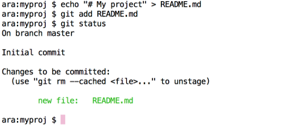

## Getting started with git

This section of the tutorial focuses on using git through the command
line, which is an interface for sending commands directly to your
computer's operating system.  On Windows computers this is the
**Command Prompt** while on a Mac you can use **Terminal**. Here's
where to find these:

**Windows**

* Go to the *Start* menu
* In the *Search* or *Run* line type **cmd** and press enter.

**Mac**

* Go to **Applications -> Utilities -> Terminal**


### How does git work?

You tell git to manage the files in your project by setting up and
working within a **git repository**. This is simply a directory which
contains some hidden files used by git for bookkeeping.

Once your repository is set up, you need to **add** files that you
want git to manage. Git will keep track of any modifications to these
files. When you have made changes to your project, you can record the
changes as a **commit**. Each commit creates a snapshot of the project
directory, allowing you to construct a record of the state of your
project through time.

### Setting up a git repository

To set up a local git repository, create a directory, move into it and
tell git to initialise the repository. You can do all of these steps
using the command line<sup>[1](#footnote)</sup> as follows:

```
mkdir myproj
cd myproj
git init
```

Here, `mkdir` and `cd` are UNIX commands to *make a directory* and
*change directory* respectively. Finally, `git init` creates the
hidden structure within the new directory that git needs to start
tracking your files.

### Tell git which files you want to track

You need to tell git which files you want it to manage within the
working directory using `git add`. First we'll use a line of UNIX
commands to create a file called README.md:

```
echo "# My project" > README.md
git add README.md
```

`git add` tells git to include the new file in the next commit
snapshot. This is called **staging** a file. `git add` is also used
when you want to tell git to stage files which git already knows
about.

You can use `git status` to produce a report about the current state
of the working directory. This will list files which contain changes
to be committed, those which contain changes that have not been
staged, and files which are not yet tracked. With the steps we've
taken so far the output should look something like this:



**Next:** [Getting your project under version control](./version_control.md)

<sup><a name="footnote">1</a></sup>If you prefer, you can set up a new
folder using the mouse/GUI, but you'll still need to navigate to the
folder on the command line using `cd`.
