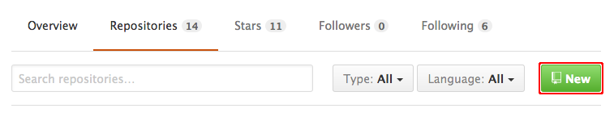
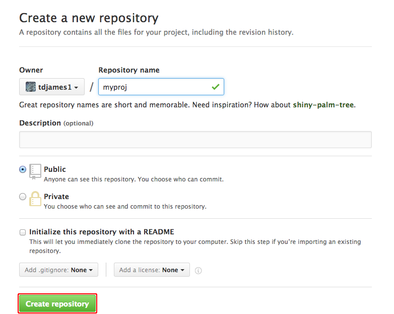
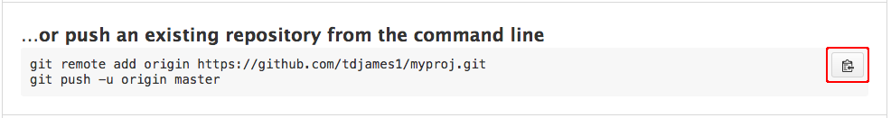

## Connecting to a remote repository

<!-- Our project is fully version controlled so we have access to a -->
<!-- detailed history of every change we've ever made to it. This is a -->
<!-- great first step but all of this only exists on our own computers at -->
<!-- the moment. -->

So far, everything that we've done has only affected our local git
repository. Likely you'll want to connect your local repository to a
*remote* repository using a hosting service such as
[GitHub](http://www.github.com). Syncing your local repository to a
remote will back up your code and provide a central store for your
project, allowing you to share your work or to access it from another
computer.

### Creating a new repository on GitHub

First, you need to create a GitHub repository to use as a remote. You
should have [created a GitHub account](./prelim.md#github)
already. Log into GitHub and go to your profile page. On the
**Repositories** tab, click **New**.



At the **Create a new repository** screen, give your repository a name
and click **Create Repository**.



The next screen provides sets of git commands for use in different
circumstances. Find the section labelled **...or push an existing
repository from the command line** and copy the commands to the
clipboard.

 [](#remote-add)

These commands tell git to set the remote repository for your project
and need to be executed from within your project directory. The first
line has the form:

```
git remote add origin https://github.com/ghuser/myproj.git
```

This indicates that you want to use the GitHub repository `myproj`
belonging to the user `ghuser` as the remote for your local
repository, using the `HTTPS` protocol<sup>[1](#footnote)</sup>.

The second line is required because, having set the remote, you need
to perform an initial `git push` to push your local changes and set up
your project to sync with the remote:

```
git push -u origin master
```

Once you've run these commands, visit the GitHub page for your remote
repository to confirm that the project has been uploaded.

**Next:** [Subsequent workflow](./workflow.md)

<sup><a name="footnote">1</a></sup>There are two alternative methods
for connecting to a remote, `HTTPS` and `ssh`.  See the
[GitHub help pages](https://help.github.com/articles/which-remote-url-should-i-use/)
for more information.
