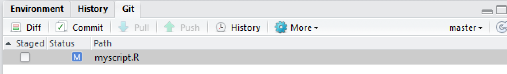
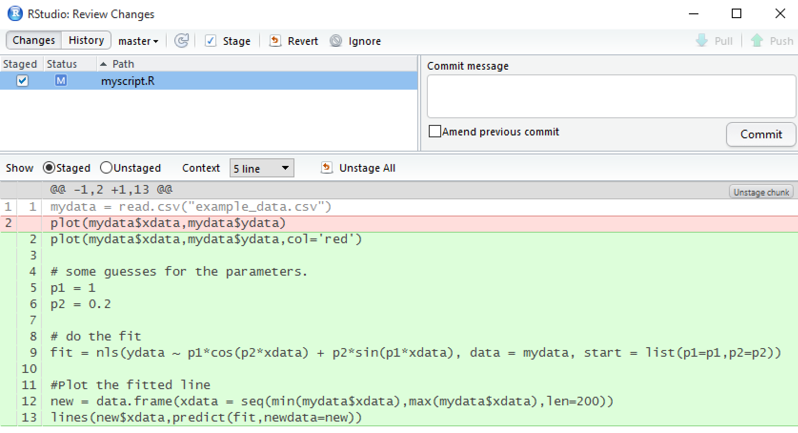
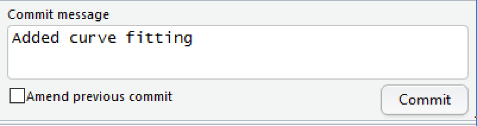

## Making changes

Make a change to your script file and save it. Now, click on the
**Git** tab in RStudio. You'll notice that there's only one file
listed, since RStudio only lists files that have changed in its git
interface.

Click on the **Staged** checkbox to stage your change. Now click on
**Diff** to display a summary of what's changed. Lines that have been
added are green. Lines that have been removed are red.

(Note that from git's point of view, a modification to a line is
actually two operations: the removal of the original line followed by
the creation of a new line.)

Add a commit message and click on **Commit**.

## Viewing history

In the **Git** tab of RStudio, click on **Diff** and then
**History**. You'll see that you can look through every commit you've
ever made. This can be extremely useful for finding bugs or looking
back to how your model looked a few months ago.

**Next:** [Setting up a remote repository](./rstudio_remote.md)
