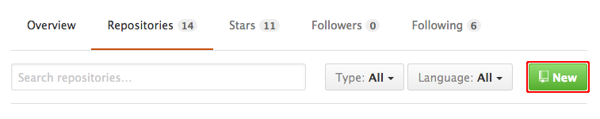
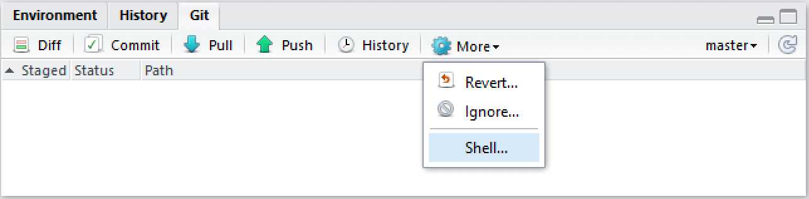
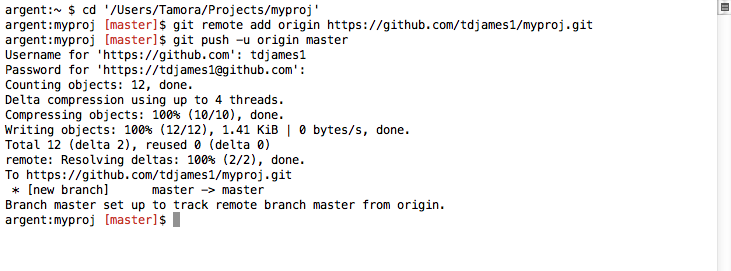

## Connecting to a remote repository on GitHub

Your project is fully version controlled so you have access to a
detailed history of every change you've ever made to it. This is a
great first step but all of this only exists on your own computer at
the moment.

Likely you'll want to connect your local repository to a remote
repository using a hosting service such as GitHub. Syncing your local
repository to a remote means that your code is backed up. Also, the
remote repository acts as a central store for your project, allowing
you to share your work or to access it from another computer.

### Creating a new repository on GitHub

First, you need to create a GitHub repository to use as a remote. Log
into GitHub and go to your profile page. On the **Repositories** tab,
click **New**.

At the **Create a new repository** screen, give your repository a name
and click **Create Repository**.

The next screen gives sets of git commands for use in various
circumstances. Find the section labelled **...or push an existing
repository from the command line** and copy the commands to the
clipboard.

These commands tell git to set the remote repository for your local
repository.

In RStudio, navigate to the **Git** tab and click on **More -> Shell...**

Paste the git commands into the shell and press **Enter** to execute them.

Confirm that the project has been uploaded to your GitHub repository.

**Next:** [Subsequent workflow](./rstudio_updates.md)
