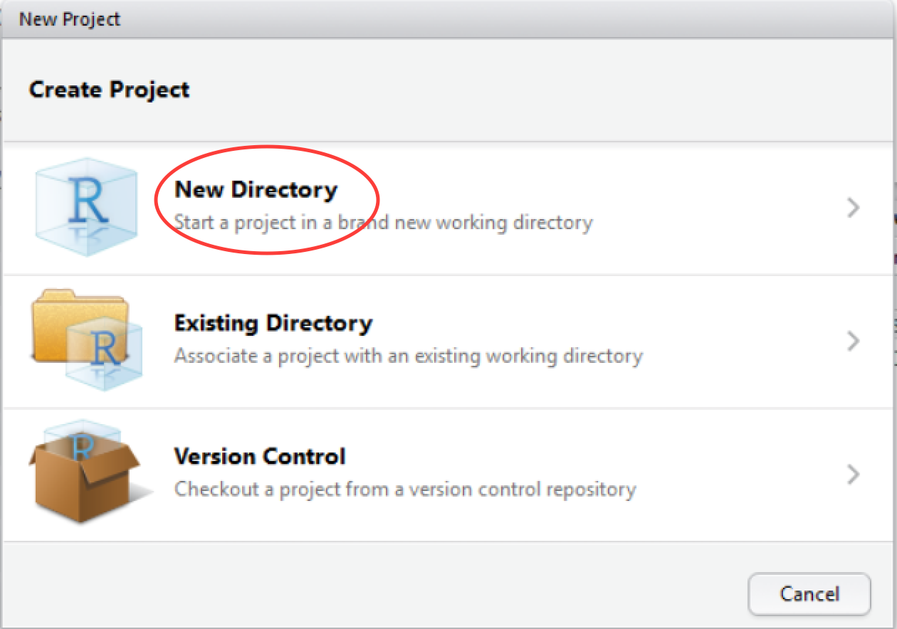
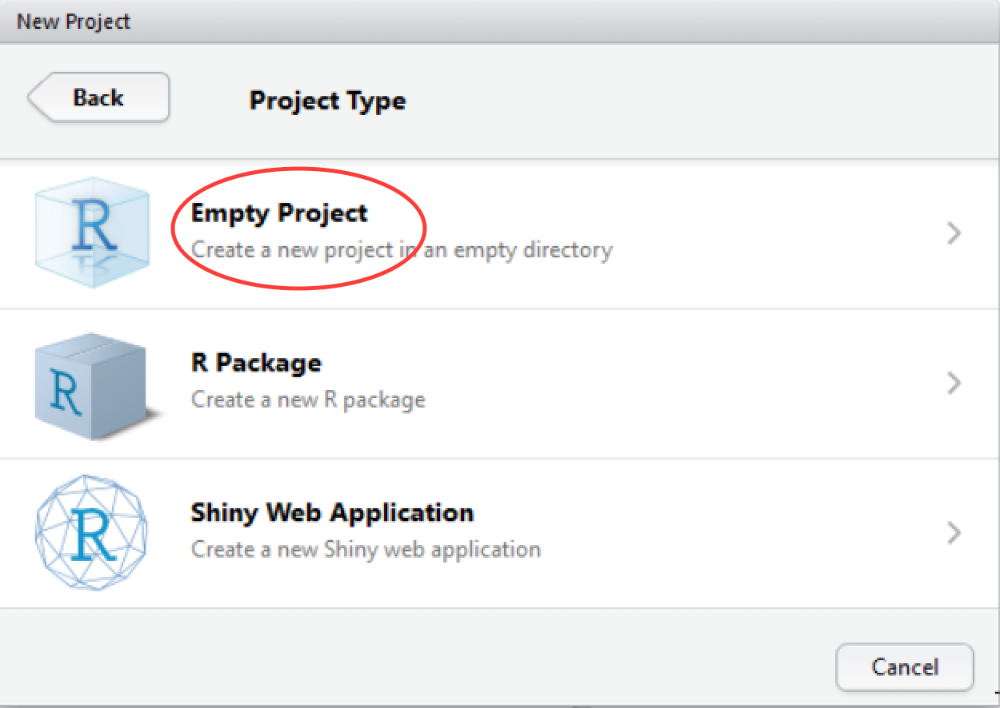
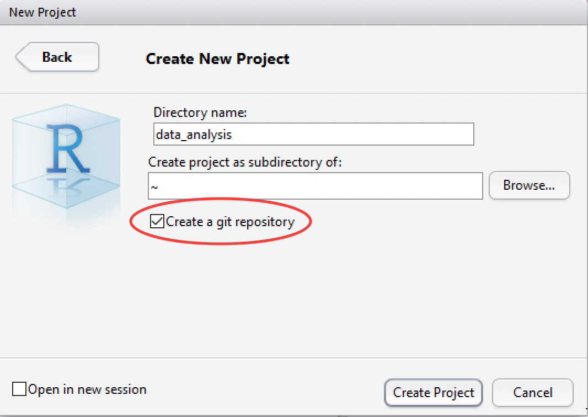
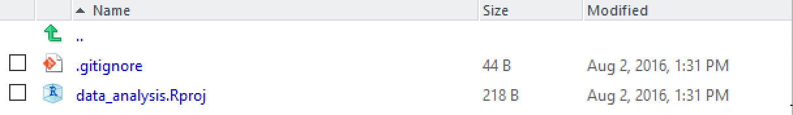

## Setting up a git project in RStudio

RStudio provides an interface for version control using git. We'll
look at setting up and managing a version controlled project through
RStudio.

Create a new project in RStudio as follows:

**File** -> **New Project** -> **New Directory**

In the **Project Type** screen, click on **Empty Project**.

In the **Create New Project** screen, give your project a name and
ensure that **Create a git repository** is checked. Click on **Create
Project**.

RStudio will create a new folder containing an empty project and set
R's working directory to within it.

Two files are created in the otherwise empty project:

* **.gitignore** -- Specifies files that should be ignored by the
  version control system.
* **data_analysis.Rproj** -- Configuration information for the RStudio
  project.

There is no need to worry about the contents of either of these for
the purposes of this tutorial.

**Next:** [Getting started with version control](./rstudio_vc.md)
