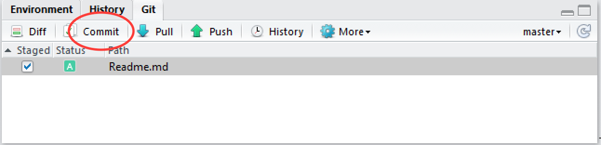
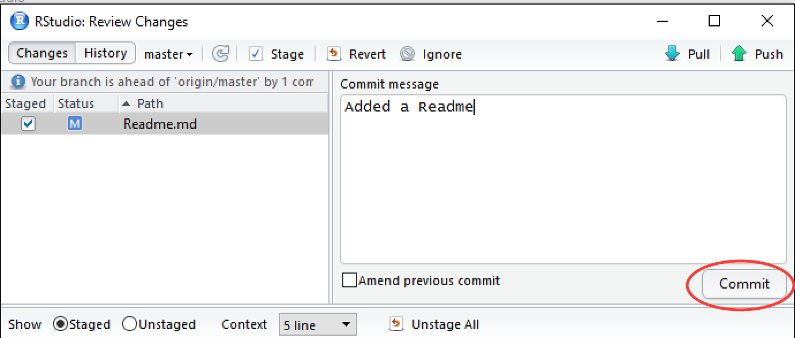
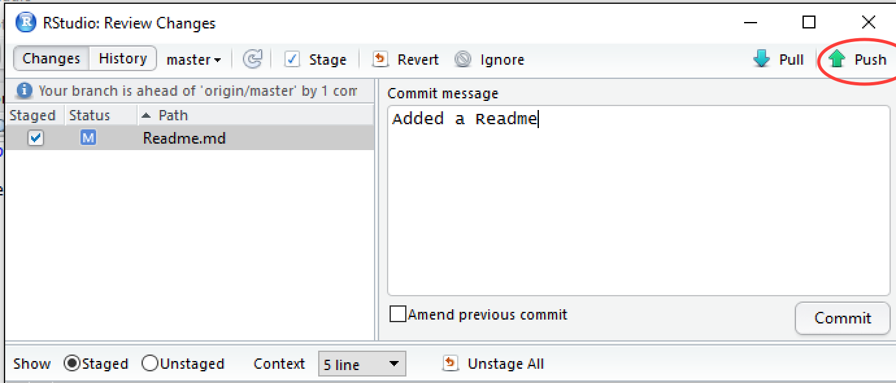

## Subsequent updates

Once a local repository has been associated with GitHub, it's not
necessary to use the command line for subsequent uploads. We'll
demonstrate this now by adding a **README.md** file to our project.

On GitHub, the README.md file is special since it is rendered by
GitHub on your repository pages. It is used by many people as an
introduction to a project.

In RStudio, click on **File -> New File -> Text File**.  Add the following
text to the file and save it as **Readme.md**.

```
# My Example Repo

This repo is used to demonstrate GitHub to users of R and R Studio.
```

In the **Git** tab of RStudio, the **Readme.md** file should be the
only file you see. Stage it as shown below and click **Commit**.



Supply a commit message and click **Commit**.



Finally, click **Push** to upload to GitHub.



**Next:** [Summary](./rstudio_summary.md)
