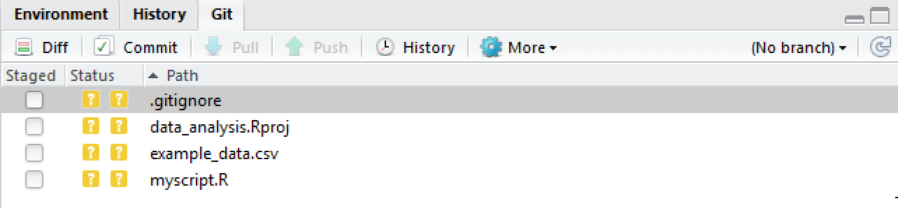
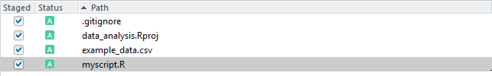
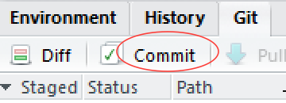
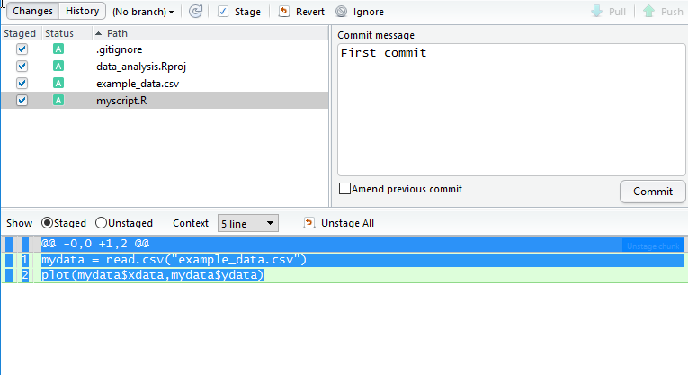
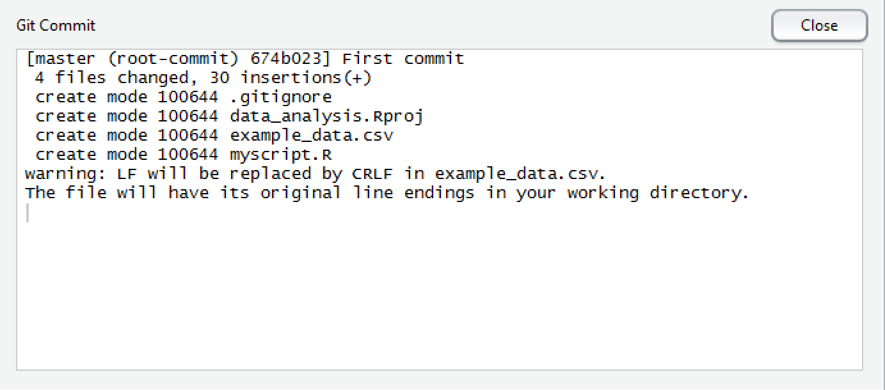

## Getting your project under version control

Once your project is set up, you can start work on your analysis,
perhaps by creating an R script that reads in your data and carries
out some preliminary analysis. For the purposes of this tutorial,
start by creating a simple script containing a few lines of R.

After you've created the first file in your project, you need to get
it under version control. By default, the git version control pane is
in the top right hand corner of RStudio. Find it and click on the
**Git** tab. You'll see a list of the files in your project directory.

If you hover the mouse pointer over the yellow ? marks in RStudio,
you'll see a tooltip telling you that the files are **untracked**. This
means that git is not tracking versions of these files.

Git will only keep track of modifications to files that it has been
asked to manage, so you need to tell git which files to track.

Tick the **Staged** checkbox for each file.

All of your files are now **staged**, ready for you to record those
changes as a **commit**. Each commit creates a snapshot of the project
directory, allowing you to record the state of your project through
time.

Click on **Commit**.

This will open a pane showing details of the commit. You need to
specify a **commit message** in the right hand panel. This should
explain the modifications that you've made. Since this is the first
commit, you can follow tradition and use a brief message such as
**First commit**, but for subsequent commits it's worth providing a
more descriptive message. Once you've typed a commit message, click on
**Commit**.

A message displaying the output from git will be shown.

Click on **Close** and you are done.

**Next:** [Making changes](./rstudio_changes.md)
