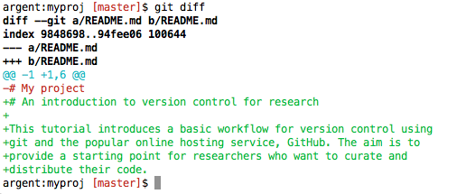

## Get your project under version control

In the previous step we initialised a git repository and added some
files that we want git to track.
<!-- TODO add git status step here -->

Creating your first commit will set up version control on the files
that you've asked git to track using `git add`.

For the first commit you can use `git commit` with the `-m` option,
which allows you to specify a commit message directly:

```
git commit -m "My first commit"
```

### Making changes

Now that your project is under version control you can keep track of
the changes that you make.

Open the README.md file and add a few lines describing your
project. Also, change the heading from "My project" to something more
specific. Save and close the file.

Now, use `git status` to check the state of the working directory. It
should report that you've modified README.md. You can use `git diff`
to review your changes:



<!-- <pre> -->
<!-- diff --git a/README.md b/README.md -->
<!-- index 9848698..94fee06 100644 -->
<!-- --- a/README.md -->
<!-- +++ b/README.md -->
<!-- @@ -1 +1,6 @@ -->
<!-- -# My project -->
<!-- +# An introduction to version control for research -->
<!-- + -->
<!-- +This tutorial introduces a basic workflow for version control using -->
<!-- +git and the popular online hosting service, GitHub. The aim is to -->
<!-- +provide a starting point for researchers who want to curate and -->
<!-- +distribute their code. -->
<!-- </pre> -->

Lines prefaced with a `-` indicate lines that have been removed, while
lines with a `+` at the start are additions.

If you're happy with the changes that you've made, use `git add` to
stage your file.

### Committing your changes

For most commits it's a good idea to write a commit message which
explains the modifications that you've made in some detail. This will
produce a record of the changes that you have made to your code over
time and may be useful when you want to review the history of your
project. Using

```
git commit
```

prompts git to open a text editor in which to compose your message.  A
good strategy is to start with a short, one-line summary of the
commit, followed by a longer description of your changes. For example:

    Update README file

    Update README file to include the proper title and a description
    of the project aims.

<!-- FIXME: link to configure subsection -->
See the section on [configuring git](./prelim.md#configure) to change the default
text editor.

### Reviewing version history

You can view the history of your project using `git log`. This lists
each commit together with its unique SHA1 identifier, date, author,
and commit message. The commit history can be extremely useful for
finding bugs or looking back to how your project looked a few months
ago. For example, to see a detailed report of the changes for a
particular commit you can use `git show -p` together with the first
part of the SHA1 identification string for that commit:

```
git show -p f9fae515
```

This will display the changes introduced in the specified commit in a
similar format to the output from `git diff`.

**Next:** [Connecting to a remote repository](./remote.md)
